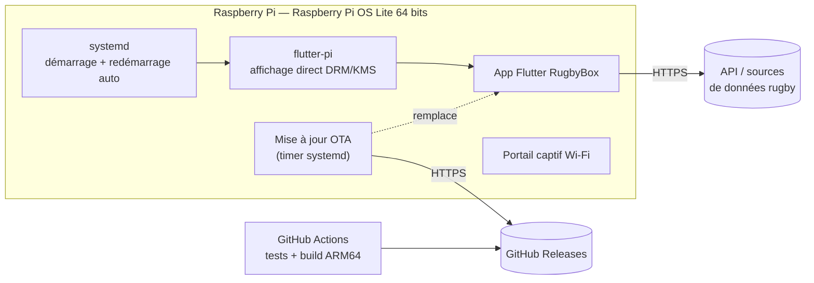

# 🏉 RugbyBox

**Un boîtier d'affichage tactile et autonome pour suivre le rugby : Top 14, Champions Cup, et surtout le RC Toulon.**

On le branche, on choisit son Wi-Fi depuis un téléphone, et c'est tout. Classements, calendrier, résultats et prochain match du RCT s'affichent en continu sur un petit écran 4", sans clavier, sans souris et sans intervention.

> [!NOTE]
> 🚧 **Projet en cours de développement.** Le matériel n'est pas encore assemblé : l'application est développée et testée sur PC, avec un écran 800×480 simulé. Voir la [feuille de route](#-feuille-de-route).

---

## Sommaire

- [Objectifs](#-objectifs)
- [Matériel cible](#-matériel-cible)
- [Architecture](#-architecture)
- [Structure du dépôt](#-structure-du-dépôt)
- [Démarrage rapide](#-démarrage-rapide)
- [Configuration](#-configuration)
- [Qualité et tests](#-qualité-et-tests)
- [Feuille de route](#-feuille-de-route)
- [Conventions](#-conventions)
- [Avertissement](#-avertissement)

---

## 🎯 Objectifs

Ce boîtier est destiné à être **offert**. Il doit donc fonctionner seul pendant des mois.

| Principe | Concrètement |
|---|---|
| **Robuste** | Les dernières données connues restent affichées si le réseau ou l'API tombe : jamais d'écran vide ni d'erreur brute. |
| **Autonome** | Démarrage automatique, redémarrage en cas de plantage, mises à jour à distance. |
| **Simple à configurer** | Configuration du Wi-Fi depuis un smartphone via un portail captif. Aucune connaissance technique requise. |
| **Durable** | Système de fichiers protégé pour préserver la carte SD, écran mis en veille la nuit. |

---

## 🔧 Matériel cible

| Composant | Choix | Remarque |
|---|---|---|
| Carte | **Raspberry Pi 4 (2 Go)** | Préféré au Pi 3A+ (512 Mo, trop juste pour Flutter) |
| Écran | Tactile capacitif IPS 4", 800×480 | Résolution simulée pendant le développement |
| Stockage | Carte MicroSD « Endurance » | Conçue pour les écritures continues |
| Alimentation | Alimentation officielle Raspberry Pi | Évite les chutes de tension |
| Boîtier | Imprimé en 3D | Avec ventilation |

---

## 🏗 Architecture

### Vue d'ensemble



- **[flutter-pi](https://github.com/ardera/flutter-pi)** exécute Flutter directement sur l'écran, sans bureau graphique (ni X11 ni Wayland). On gagne en mémoire et en temps de démarrage.
- **systemd** lance l'application au démarrage et la relance si elle plante.
- **Les mises à jour OTA** récupèrent les nouvelles versions publiées sur GitHub Releases. En cas d'échec, l'appareil revient automatiquement à la version précédente.

### Architecture de l'application

Le code est organisé **par fonctionnalité** (*feature-first*). Chaque fonctionnalité est découpée en trois couches :

```
presentation  ──►  domain  ◄──  data
 (widgets,         (entités,     (API, cache,
  état Riverpod)    contrats)     conversion JSON)
```

- **`domain`** : du Dart pur, sans Flutter, HTTP ni JSON. Toutes les dépendances pointent vers cette couche.
- **`data`** : sources de données interchangeables (fictive / API) derrière une interface commune, avec un cache local qui garde les dernières données valides.
- **`presentation`** : widgets et gestion d'état avec **[Riverpod](https://riverpod.dev)**.

L'application est assemblée à **un seul endroit**, [`bootstrap()`](rugby_box/lib/app/bootstrap.dart). Deux points d'entrée l'appellent :

| Point d'entrée | Usage | Configuration |
|---|---|---|
| [`main.dart`](rugby_box/lib/main.dart) | Production (Raspberry Pi) | Données réelles |
| [`main_desktop.dart`](rugby_box/lib/main_desktop.dart) | Développement (PC) | Données fictives, simulateur d'écran |

---

## 📁 Structure du dépôt

```
RugbyBox/
├── README.md
└── rugby_box/                  # Application Flutter
    ├── lib/
    │   ├── main.dart           # Entrée production
    │   ├── main_desktop.dart   # Entrée développement
    │   ├── app/                # Assemblage : bootstrap, widget racine
    │   ├── core/               # Transversal : configuration, logs, erreurs
    │   └── features/           # Fonctionnalités (classements, calendrier…)
    ├── test/
    ├── linux/                  # Cible Linux (WSL, intégration continue)
    └── windows/                # Cible de développement
```

Dossiers prévus : `deploy/` (service systemd, programme de mise à jour OTA, provisionnement) et `.github/workflows/` (intégration continue).

---

## 🚀 Démarrage rapide

### Prérequis

- [Flutter](https://docs.flutter.dev/get-started/install) **3.47+** (Dart 3.13+), canal stable
- Windows avec le support Flutter Desktop activé, ou Linux (WSL2 accepté)

### Lancer l'application

```bash
git clone <url-du-dépôt> RugbyBox
cd RugbyBox/rugby_box
flutter pub get

# Mode développement (données fictives)
flutter run -d windows -t lib/main_desktop.dart

# Sous Linux / WSL2
flutter run -d linux -t lib/main_desktop.dart
```

> [!TIP]
> Sans `-t`, Flutter lance `lib/main.dart`, le point d'entrée de production.

---

## ⚙️ Configuration

La configuration est définie par [`AppConfig`](rugby_box/lib/core/config/app_config.dart) et injectée au démarrage par `bootstrap()`.

| Paramètre | Rôle | Dev | Prod |
|---|---|---|---|
| `useMockData` | Données fictives au lieu de l'API | `true` | `false` |

Les secrets (clés d'API) seront passés via `--dart-define-from-file` à partir d'un fichier `config/*.local.json`. **Ce fichier est ignoré par Git et ne doit jamais être versionné.**

---

## ✅ Qualité et tests

Depuis `rugby_box/` :

```bash
dart format .       # Formatage
flutter analyze     # Analyse statique (mode strict)
flutter test        # Tests
```

L'analyse utilise `strict-casts`, `strict-inference` et `strict-raw-types`, en plus des règles de [`flutter_lints`](https://pub.dev/packages/flutter_lints). Voir [`analysis_options.yaml`](rugby_box/analysis_options.yaml).

**Ces trois commandes doivent réussir avant chaque commit.**

---

## 🗺 Feuille de route

- [ ] **Phase 0 — Fondations**
  - [x] Squelette du projet, point d'assemblage `bootstrap()`, Riverpod
  - [x] Analyse statique stricte
  - [ ] Choix et évaluation de la source de données
- [ ] **Phase 1 — Application sur PC**
  - [x] Simulateur d'écran 800×480 et gestion du tactile
  - [ ] Modèle de domaine (équipes, classements, matchs)
  - [ ] Couche de données : fausse source, API, cache local
  - [ ] Écrans : prochain match RCT, Top 14, Champions Cup, résultats
  - [ ] Résilience : gestion des erreurs globales, logs
- [ ] **Phase 2 — Intégration continue** : tests + compilation Linux ARM64 via GitHub Actions
- [ ] **Phase 3 — Mise en route du matériel** : Raspberry Pi OS Lite, flutter-pi, écran tactile
- [ ] **Phase 4 — Intégration système** : service systemd, watchdog, système de fichiers en lecture seule, veille de l'écran
- [ ] **Phase 5 — Configuration Wi-Fi** : portail captif
- [ ] **Phase 6 — Mises à jour OTA** : GitHub Releases, vérification de l'intégrité, retour arrière automatique
- [ ] **Phase 7 — Finitions** : boîtier 3D, notice utilisateur, test d'endurance

---

## 📐 Conventions

- **Branches** : `main` est toujours stable ; les développements se font sur des branches `feat/…`, `fix/…`.
- **Commits** : messages courts et descriptifs, à l'impératif.
- **Code** : pas de logique métier dans les widgets ; les objets du domaine sont immuables ; les heures sont stockées en UTC et converties en heure de Paris (`Europe/Paris`) à l'affichage uniquement.
- **Dépendances** : ajoutées au cas par cas, avec une justification. Aucun plugin réservé au bureau dans le code de production.

---

## ⚖️ Avertissement

Projet personnel et non commercial. **Non affilié** à la Ligue Nationale de Rugby, à l'EPCR ni au Rugby Club Toulonnais. Les noms, logos et marques cités appartiennent à leurs propriétaires respectifs.

Licence : *à définir.*
